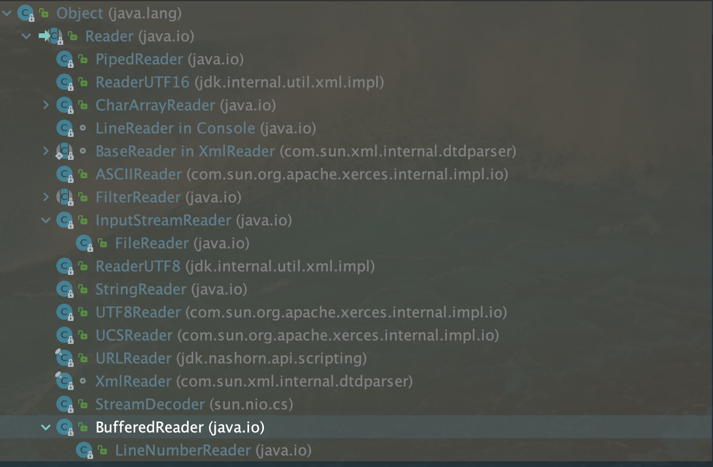

## Java 的 I/O 大概可以分成以下几类： 

- 磁盘操作：File
- 字节操作：InputStream 和 OutputStream
- 字符操作：Reader 和 Writer
- 对象操作：Serializable
- 网络操作：Socket
- 新的输入/输出：NIO


### 磁盘操作

```java_holder_method_tree
public static void listAllFiles(File dir) {
    if (dir == null || !dir.exists()) {
        return;
    }
    if (dir.isFile()) {
        System.out.println(dir.getName());
        return;
    }
    for (File file : dir.listFiles()) {
        listAllFiles(file);
    }
}
```


### 字节操作

#### 简单文件复制
```java_holder_method_tree
public static void copyFile(String src, String dist) throws IOException {
    FileInputStream in = new FileInputStream(src);
    FileOutputStream out = new FileOutputStream(dist);

    byte[] buffer = new byte[20 * 1024];
    int cnt;

    // read() 最多读取 buffer.length 个字节
    // 返回的是实际读取的个数
    // 返回 -1 的时候表示读到 eof，即文件尾
    while ((cnt = in.read(buffer, 0, buffer.length)) != -1) {
        out.write(buffer, 0, cnt);
    }

    in.close();
    out.close();
}
```

#### 装饰者模式

Java I/O 使用了装饰者模式来实现。以 InputStream 为例，

* InputStream 是抽象组件；
* FileInputStream 是 InputStream 的子类，属于具体组件，提供了字节流的输入操作；
* FilterInputStream 属于抽象装饰者，装饰者用于装饰组件，为组件提供额外的功能。
    * BufferedInputStream 为 FileInputStream 提供缓存的功能。
    * DataInputStream 装饰者提供了对更多数据类型进行输入的操作，比如 int、double 等基本类型。
     

实例化一个具有缓存功能的字节流对象时，只需要在 FileInputStream 对象上再套一层 BufferedInputStream 对象即可。
```java_holder_method_tree
FileInputStream fileInputStream = new FileInputStream(filePath);
BufferedInputStream bufferedInputStream = new BufferedInputStream(fileInputStream);
```

### 字符操作
编码就是把字符转换为字节，而解码是把字节重新组合成字符

如果编码和解码过程使用不同的编码方式那么就出现了乱码。

* GBK 编码中，中文字符占 2 个字节，英文字符占 1 个字节；
* UTF-8 编码中，中文字符占 3 个字节，英文字符占 1 个字节；
* UTF-16be 编码中，中文字符和英文字符都占 2 个字节。
* UTF-16be 中的 be 指的是 Big Endian，也就是大端。相应地也有 UTF-16le，le 指的是 Little Endian，也就是小端。

Java 使用双字节编码 UTF-16be，这不是指 Java 只支持这一种编码方式，
而是说 char 这种类型使用 UTF-16be 进行编码。
char 类型占 16 位，也就是两个字节，
Java 使用这种双字节编码是为了让一个中文或者一个英文都能使用一个 char 来存储。

#### String 的编码方式
String 可以看成一个字符序列，可以指定一个编码方式将它编码为字节序列，也可以指定一个编码方式将一个字节序列解码为 String。

```java_holder_method_tree
String str1 = "中文";
byte[] bytes = str1.getBytes("UTF-8");
String str2 = new String(bytes, "UTF-8");
System.out.println(str2);
```
> 在调用无参数 getBytes() 方法时，默认的编码方式不是 UTF-16be。

双字节编码的好处是可以使用一个 char 存储中文和英文，而将 String 转为 bytes[] 字节数组就不再需要这个好处，因此也就不再需要双字节编码。
getBytes() 的默认编码方式与平台有关，一般为 UTF-8。
```java_holder_method_tree
byte[] bytes = str1.getBytes();
```


#### Reader 与 Writer
不管是磁盘还是网络传输，最小的存储单元都是字节，而不是字符。但是在程序中操作的通常是字符形式的数据，因此需要提供对字符进行操作的方法。
> 装饰者模式

* InputStreamReader 实现从字节流解码成字符流；
* OutputStreamWriter 实现字符流编码成为字节流。

<div align="left"> </div><br>

实现逐行输出文本文件的内容
```java_holder_method_tree
public static void readFileContent(String filePath) throws IOException {

    FileReader fileReader = new FileReader(filePath);
    BufferedReader bufferedReader = new BufferedReader(fileReader);

    String line;
    while ((line = bufferedReader.readLine()) != null) {
        System.out.println(line);
    }

    // 装饰者模式使得 BufferedReader 组合了一个 Reader 对象
    // 在调用 BufferedReader 的 close() 方法时会去调用 Reader 的 close() 方法
    // 因此只要一个 close() 调用即可
    bufferedReader.close();
}
```

### 对象操作

#### 序列化
序列化就是将一个对象转换成字节序列，方便存储和传输。
* 序列化：ObjectOutputStream.writeObject()
* 反序列化：ObjectInputStream.readObject()

> 不会对静态变量进行序列化，因为序列化只是保存对象的状态，静态变量属于类的状态。
  
#### transient
transient 关键字可以使一些属性不会被序列化。

ArrayList 中存储数据的数组 elementData 是用 transient 修饰的，因为这个数组是动态扩展的，并不是所有的空间都被使用，因此就不需要所有的内容都被序列化。通过重写序列化和反序列化方法，使得可以只序列化数组中有内容的那部分数据。

```java_holder_method_tree
private transient Object[] elementData;
```

### 网络操作
Java 中的网络支持：
* InetAddress：用于表示网络上的硬件资源，即 IP 地址；
* URL：统一资源定位符；
* Sockets：使用 TCP 协议实现网络通信；
* Datagram：使用 UDP 协议实现网络通信。


#### URL
可以直接从 URL 中读取字节流数据。
```java_holder_method_tree
public static void main(String[] args) throws IOException {

    URL url = new URL("http://www.baidu.com");

    /* 字节流 */
    InputStream is = url.openStream();

    /* 字符流 */
    InputStreamReader isr = new InputStreamReader(is, "utf-8");

    /* 提供缓存功能 */
    BufferedReader br = new BufferedReader(isr);

    String line;
    while ((line = br.readLine()) != null) {
        System.out.println(line);
    }

    br.close();
}
```


### NIO

新的输入/输出 (NIO) 库是在 JDK 1.4 中引入的，弥补了原来的 I/O 的不足，提供了高速的、面向块的 I/O。

| IO |	NIO |
| :---: | :---: |
|面向流  |	面向缓冲|
|阻塞IO |非阻塞IO|
|无	|选择器|


#### 通道与缓冲区

**1. 通道**

通道 Channel 是对原 I/O 包中的流的模拟，可以通过它读取和写入数据。

通道与流的不同之处在于，流只能在一个方向上移动(一个流必须是 InputStream 或者 OutputStream 的子类)，而通道是双向的，可以用于读、写或者同时用于读写。

通道包括以下类型：

* FileChannel：从文件中读写数据；
* DatagramChannel：通过 UDP 读写网络中数据；
* SocketChannel：通过 TCP 读写网络中数据；
* ServerSocketChannel：可以监听新进来的 TCP 连接，对每一个新进来的连接都会创建一个 SocketChannel。

**2. 缓冲区**

发送给一个通道的所有数据都必须首先放到缓冲区中，同样地，从通道中读取的任何数据都要先读到缓冲区中。也就是说，不会直接对通道进行读写数据，而是要先经过缓冲区。

缓冲区实质上是一个数组，但它不仅仅是一个数组。缓冲区提供了对数据的结构化访问，而且还可以跟踪系统的读/写进程。

缓冲区包括以下类型：
- ByteBuffer
- CharBuffer
- ShortBuffer
- IntBuffer
- LongBuffer
- FloatBuffer
- DoubleBuffer

#### 缓冲区状态变量

* capacity：最大容量；
* position：当前已经读写的字节数；
* limit：还可以读写的字节数。


### 文件 NIO 实例

NIO 快速复制文件的实例：
```java_holder_method_tree
public static void fastCopy(String src, String dist) throws IOException {

    /* 获得源文件的输入字节流 */
    FileInputStream fin = new FileInputStream(src);

    /* 获取输入字节流的文件通道 */
    FileChannel fcin = fin.getChannel();

    /* 获取目标文件的输出字节流 */
    FileOutputStream fout = new FileOutputStream(dist);

    /* 获取输出字节流的文件通道 */
    FileChannel fcout = fout.getChannel();

    /* 为缓冲区分配 1024 个字节 */
    ByteBuffer buffer = ByteBuffer.allocateDirect(1024);

    while (true) {

        /* 从输入通道中读取数据到缓冲区中 */
        int r = fcin.read(buffer);

        /* read() 返回 -1 表示 EOF */
        if (r == -1) {
            break;
        }

        /* 切换读写 */
        buffer.flip();

        /* 把缓冲区的内容写入输出文件中 */
        fcout.write(buffer);

        /* 清空缓冲区 */
        buffer.clear();
    }
}
```

### 选择器

NIO 实现了 IO 多路复用中的 Reactor 模型，一个线程 Thread 使用一个选择器 Selector 通过轮询的方式去监听多个通道 Channel 上的事件，从而让一个线程就可以处理多个事件。
> 应该注意的是，只有套接字 Channel 才能配置为非阻塞，而 FileChannel 不能，为 FileChannel 配置非阻塞也没有意义。

#### 1. 创建选择器
```java_holder_method_tree
Selector selector = Selector.open();
```
#### 2. 将通道注册到选择器上
```java_holder_method_tree
ServerSocketChannel ssChannel = ServerSocketChannel.open();
ssChannel.configureBlocking(false);
ssChannel.register(selector, SelectionKey.OP_ACCEPT);
```
通道必须配置为非阻塞模式，否则使用选择器就没有任何意义了，因为如果通道在某个事件上被阻塞，那么服务器就不能响应其它事件，必须等待这个事件处理完毕才能去处理其它事件，显然这和选择器的作用背道而驰。

在将通道注册到选择器上时，还需要指定要注册的具体事件，主要有以下几类：

* SelectionKey.OP_CONNECT
* SelectionKey.OP_ACCEPT
* SelectionKey.OP_READ
* SelectionKey.OP_WRITE

它们在 SelectionKey 的定义如下：
```java_holder_method_tree
public static final int OP_READ = 1 << 0;
public static final int OP_WRITE = 1 << 2;
public static final int OP_CONNECT = 1 << 3;
public static final int OP_ACCEPT = 1 << 4;
```
可以看出每个事件可以被当成一个位域，从而组成事件集整数。例如：
```java_holder_method_tree
int interestSet = SelectionKey.OP_READ | SelectionKey.OP_WRITE;
```
#### 3. 监听事件

> int num = selector.select();

使用 select() 来监听到达的事件，它会一直阻塞直到有至少一个事件到达。

#### 4. 获取到达的事件
```java_holder_method_tree
Set<SelectionKey> keys = selector.selectedKeys();
Iterator<SelectionKey> keyIterator = keys.iterator();
while (keyIterator.hasNext()) {
    SelectionKey key = keyIterator.next();
    if (key.isAcceptable()) {
        // ...
    } else if (key.isReadable()) {
        // ...
    }
    keyIterator.remove();
}
```

5. 事件循环
因为一次 select() 调用不能处理完所有的事件，并且服务器端有可能需要一直监听事件，因此服务器端处理事件的代码一般会放在一个死循环内。

while (true) {
    int num = selector.select();
    Set<SelectionKey> keys = selector.selectedKeys();
    Iterator<SelectionKey> keyIterator = keys.iterator();
    while (keyIterator.hasNext()) {
        SelectionKey key = keyIterator.next();
        if (key.isAcceptable()) {
            // ...
        } else if (key.isReadable()) {
            // ...
        }
        keyIterator.remove();
    }
}


### 套接字 NIO 实例
[NIOServer](../com/hanxiaocu/io/NIOServer.java)

### 内存映射文件

内存映射文件 I/O 是一种读和写文件数据的方法，它可以比常规的基于流或者基于通道的 I/O 快得多。
> 向内存映射文件写入可能是危险的，只是改变数组的单个元素这样的简单操作，就可能会直接修改磁盘上的文件。修改数据与将数据保存到磁盘是没有分开的
```java_holder_method_tree
MappedByteBuffer mbb = fc.map(FileChannel.MapMode.READ_WRITE, 0, 1024);
```
